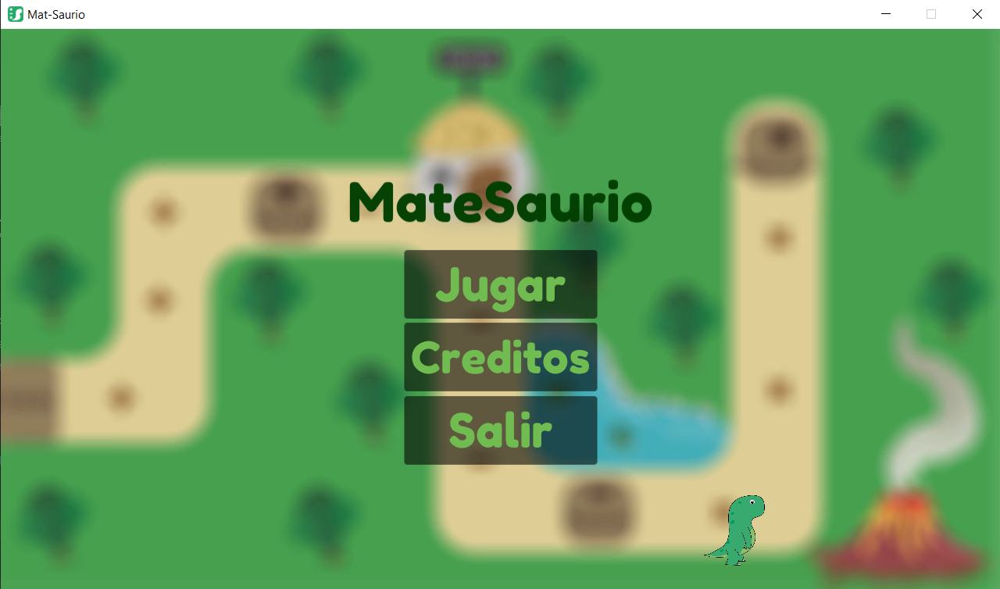
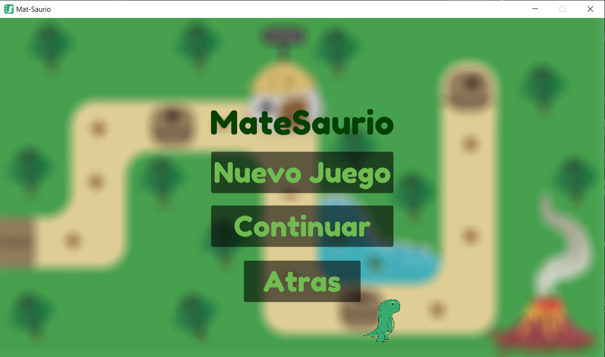
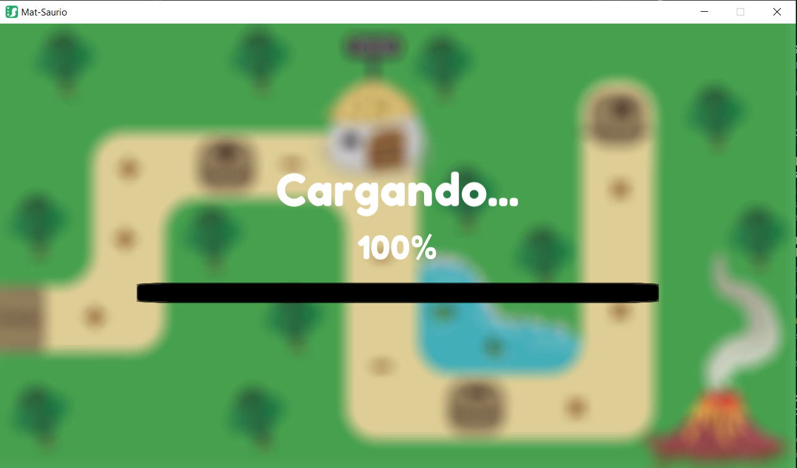
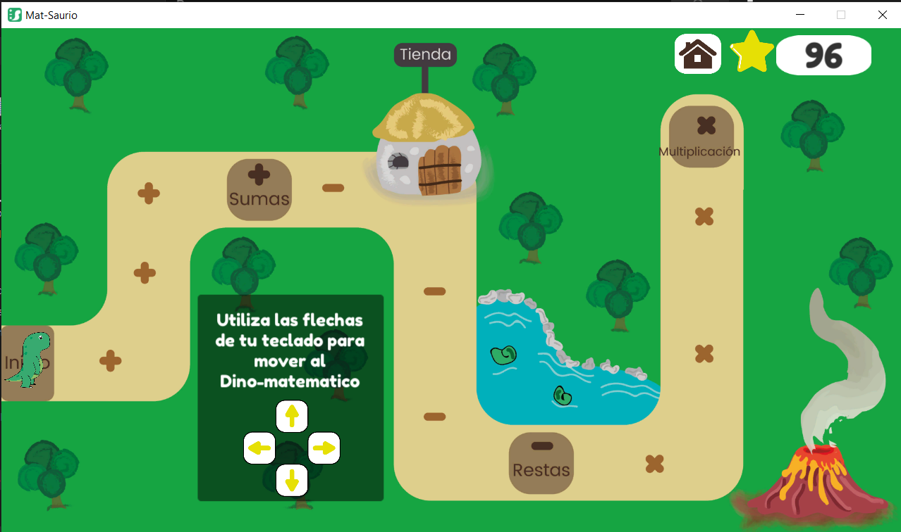
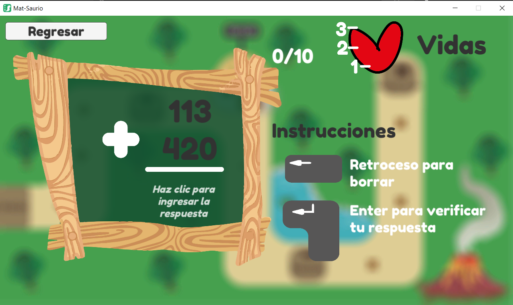
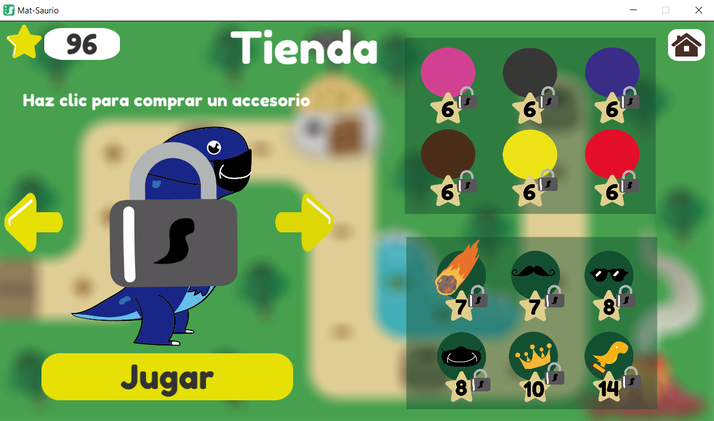
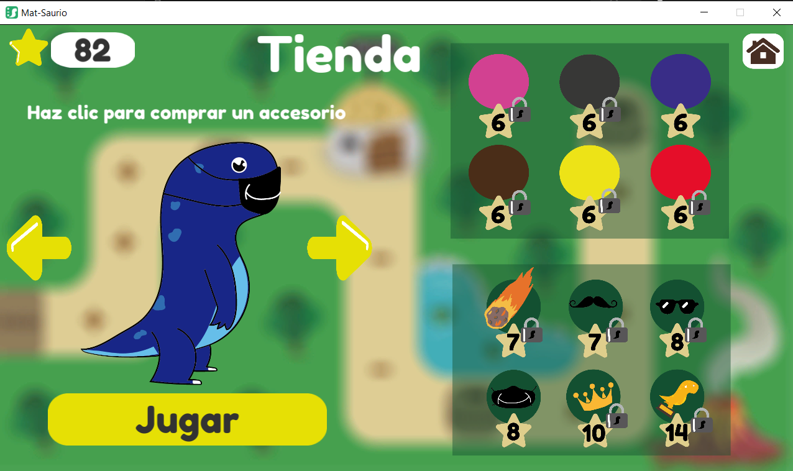

# Mat-Saurio
My social service project, a game made it for support the learning of maths focused on elementary school children.

Start Menu if is the first time that you ran the game

Start Menu with game progress

Loading Scene

The world map and the user interface displays "How to Play" instructions and the points(stars) that you have earned. You are free to explore the path, but you must play the levels in order to unlock the next one. When you reach a mathematical sign, a message will appear above the player (the dinosaur) and give you instructions to start the level.

The game begins with an interface showing instructions on how to play. To pass a level, you need to solve 10 mathematical operations, and you have 3 life points in case you fail. If you fail, the level will restart.

The store, where you can change your points(stars) to unlock some skins

